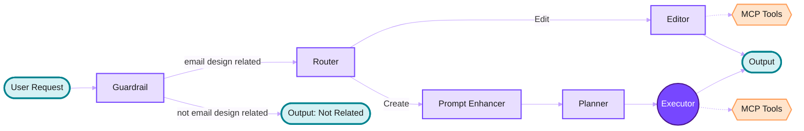

# AI Co-Pilot

Amplifying creativity inside Beefree/RGE Studio

---

# AI is becoming the baseline

From **Stensul** to **Knak**, from **Stripo** to **ActiveCampaign**,  
the message is the same: *"Give us a prompt. We'll generate your campaign."*

- Full emails
- Layouts + copy
- Even automation logic

**But is speed alone enough?**

---

# Speed without control is not the future

Distributed teams working across complex stacks do not just want automation. They care about:

- **Brand integrity**
- **Accessibility**
- **Clean, stable HTML**
- **Control**

> The real question is: What does responsible, reliable AI look like inside the tools professionals trust every day?

---

# Assistive. Not autonomous.

Our AI Co-Pilot does not replace humans, but it is:

- An **assistant**
- A **co-creator**
- A **force multiplier** for human creativity

An **intelligent design partner**!

---

# AI Co-Pilot in Beefree/RGE Studio

The customer brings:
- The **idea**
- The **brief**
- The **brand**

The AI Co-Pilot helps turn that into a full, stable, on-brand email inside the design environment they already trust.

---
layout: center
---

<h1 style="font-size: 2.5rem; line-height: 1.3;">We are not automating creativity.</h1>
<h1 style="font-size: 2.5rem; line-height: 1.3; margin-top: 1rem;">We are amplifying it.</h1>

<a href="https://growens.atlassian.net/wiki/spaces/BEEPro/pages/6270877697/Beefree+App+-+AI+Co-Pilot+-+Beta+version" target="_blank" style="color: #7747ff; text-decoration: none; border-bottom: 1px solid #7747ff;">Beefree AI Co-Pilot internal docs</a>

---
layout: center
---

# Now, let's get more technical

A deep dive into how we built it

---

# Agenda

1. Agent vs Tools
2. Beefree AI Co-Pilot Capabilities
3. Architecture
4. The challenges we faced
5. How we solved them
6. Lessons Learned
7. Live Demo
8. What's Next

---

# Agent vs Tools

<React is="AgentVsToolsStatic" />

---

# Agent vs Tools

<React is="AgentVsToolsAnimated" />

---

# Beefree AI Co-Pilot Capabilities

<React is="Capabilities" />

---
layout: default
---

# Architecture

---

# The challenges we faced

1. **Consistency**: Tools get called correctly, but not consistently.  Use blue in row 1, red in row 2, blue again in row 3.
2. **Probabilistic execution**: Just because you ask for something in a prompt doesn't guarantee it happens 100% of the time. LLMs are non-deterministic by nature.
3. **Prompt engineering**: Every line you add to the system prompt competes with every line already there. By adding you dilute.
4. **Evaluating correctness**: You can't unit test an agent. Knowing if it's doing a good job is non-trivial.
5. **LLMs know HTML, CSS, Python, React** and other common languages fluently. 
On the other hand **LLMs don't know Beefree custom JSON format** or our specific **MCP toolset**.

> Our email JSON format is harder to work with but it's **why our emails render correctly on many email clients**.

---

# How we solved them

**The key insight:** Separate planning from execution.

1. **Planner creates a structured plan**: Instead of letting the agent call tools directly, we ask it to generate a detailed plan in a predefined JSON format.

2. **Executor runs the plan deterministically**: Tool calls are no longer made by the agent. The executor reads the plan and programmatically calls the right tools in the right sequence.

> By moving tool calls out of the agent's hands, we turned an unreliable process into a predictable one.

---

<h1 style="margin-bottom: 0.5rem !important;">Before & After</h1>

<React is="BeforeAfter" />

---

# Lessons Learned

1. **A structured plan is likely one key to good results.**  
   A tight output schema changes everything.

2. **Less AI is sometimes the right call.**  
   Deterministic beats autonomous when you need reliability.

3. **Prompt engineering is never done, and addition is the enemy.**  
   Every edge case someone wants to fix with a new line. Resist it.

---
layout: center
class: text-center
---

# Demo

"Please, God of demos, stay with us..."

---
layout: default
class: '!p-0 no-watermark'
---

<React is="DemoGrid" />

---

# What's Next

Some of the next steps we are excited about:

- **Parallelizing the planner**  
  Split into an orchestrator + N parallel section planners. Faster, and better at complex multi-section emails.

- **UX refinements**  
  Better feedback loops: revert actions, loading states, and smoother editing experience.

- **Personalized context**  
  Smart copy suggestions and learning from your patterns: styles, templates, and workflows you use most.

- **Hackaton: Fine-tuning open source LLM on our toolset**  
  Instead of teaching the LLM our JSON through prompts, train it to speak our MCP tools natively.

---
layout: center
class: text-center
---

# Thanks for Listening!

<!-- Write a travel inspiration email in Airbnb's style. Tone: warm, human, wanderlust-driven. Structure: full-bleed destination hero → friendly headline about belonging anywhere → two-sentence intro → three-column destination cards each with a photo, location name, and starting price → host spotlight split-screen with photo and short quote → CTA: 'Start Exploring.' Warm coral and white palette. -->

<!-- Write a premiere email for a new dark thriller series in Netflix's style. Tone: cinematic, mysterious. Structure: full-bleed key art hero with title treatment overlay → release date in red → two-line series logline → three-column episode preview strip with stills and one-line teasers → cast spotlight split-screen → CTA: 'Watch Now.' Black background, Netflix red accents only. -->

<!-- Write a feature announcement email in Spotify's style. Tone: friendly, energetic, slightly playful. Structure: colorful gradient hero with feature name large → two-sentence explanation of what's new → three-column icon triptych showing how it works step by step → animated GIF of the feature in the app → user testimonial pull quote → CTA: 'Try It Now.' Spotify green on dark background. -->

<!-- Write a launch email for a new iPhone in Apple's style. Tone: quiet confidence, zero hype. Structure: full-bleed product hero on white → five-word headline → two-sentence intro → alternating split-screen sections for three key features, each with a close-up shot and one paragraph → specs comparison table against previous model → primary CTA: 'Order Now'. Pure white background, SF Pro typography implied, single grey accent. -->